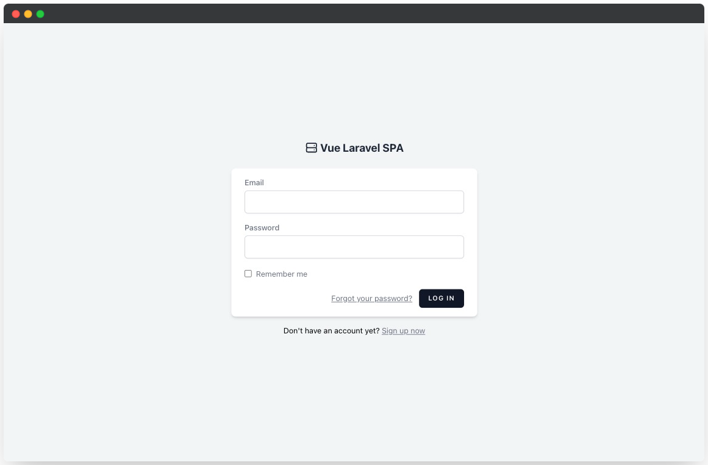
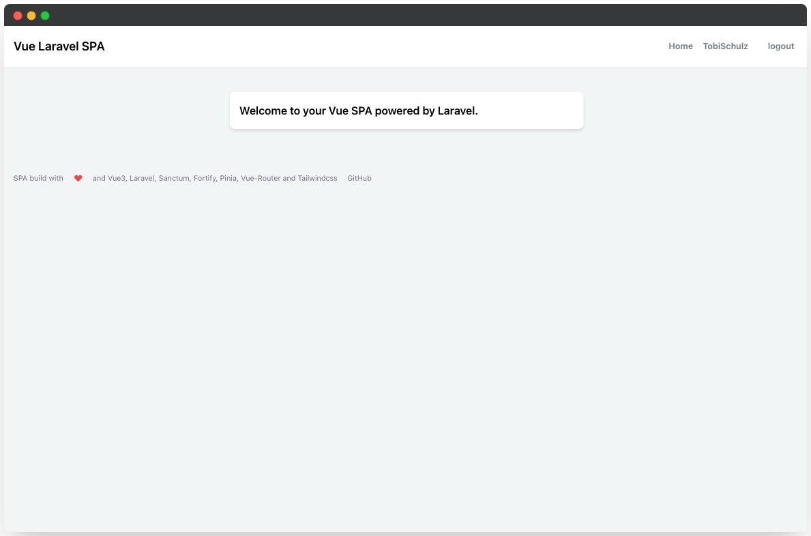
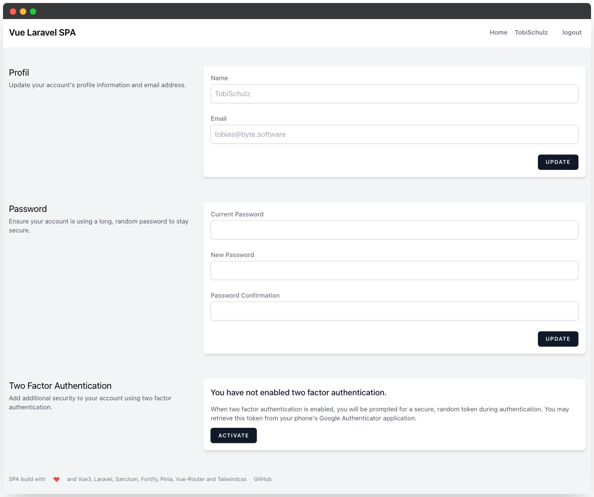

<p align="center">
    
    
</p>



## Vue Laravel SPA

A simple and clean starter-kit to start a new SPA project. Its like Jetstream without Inertia but with Vue-Router and Pinia as store. 

This starter-kit uses the following tools:

- [Vue 3](https://github.com/vuejs/vue)
- [Vue Router](https://router.vuejs.org/)
- [Pinia](https://pinia.vuejs.org/)
- [Axios](https://axios-http.com/docs/intro)
- [Tailwindcss 3.x](https://tailwindcss.com/)
- [Laravel 11.x](https://laravel.com/docs/11.x)
- [Laravel Sanctum](https://laravel.com/docs/11.x/sanctum)
- [Laravel Fortify](https://laravel.com/docs/11.x/fortify)

## Features

The following features are implemented in this Vue SPA:

- ✅ Authentication (Cookie based by sanctum)
- ✅ Passwort Reset
- ✅ Registration
- ✅ Profile Management
- ✅ Password Confirmation
- ✅ Two Factor Authentication
- ✅ E-Mail Verification

## Roadmap

Missing something? Feel free to tell me what would be a nice addition to this starter-kit.

- 🔘 Darkmode
- 🔘 Better error handling on UI
- 🔘 Password confirmation fixes
- 🔘 Example page with form and api controller
- 🔘 Laravel Pint
- 🔘 PWA
- 🔘 More Tests
- 🔘 CSP
- 🔘 Replace PHPUnit with Pest

## Getting started

You can quick start with this starter-kit by running the **`bin/install.sh`** script or manually run the containing commands. 

After that you can login with `test@example.com` and the password `password`

Make sure to set your current domain in the .env file:

```
APP_URL=http://vue-laravel-spa.test
```

## Screenshots

A Picture Is Worth More Than A Thousand Words.





Consider to support my work and say thank you with a coffee. I would very much appreciate that. 


[buymeacoffee.com/tobiasschulz](https://www.buymeacoffee.com/tobiasschulz)

## Testing

PHPunit is ready setup to test the API side. Tested are all Sanctum and Fortify features cause there are heavily based on there original tests. Thats a good starting point to add tests for your next project. To run the tests you can call phpunit like this:

```bash
php artisan test
```

## Contributing

Thank you for considering contributing to the Laravel framework! The contribution guide can be found in the [Laravel documentation](https://laravel.com/docs/contributions).

## Code of Conduct

In order to ensure that the Laravel community is welcoming to all, please review and abide by the [Code of Conduct](https://laravel.com/docs/contributions#code-of-conduct).

## Security Vulnerabilities

If you discover a security vulnerability within Laravel, please send an e-mail via [tobias@byte.software](mailto:tobias@byte.software). All security vulnerabilities will be promptly addressed.

## License

The Laravel framework is open-sourced software licensed under the [MIT license](https://opensource.org/licenses/MIT).    
The Vue framework is open-sourced software licensed under the [MIT license](https://opensource.org/licenses/MIT).    
This repository is open-sourced software licensed under the [MIT license](https://opensource.org/licenses/MIT).    
