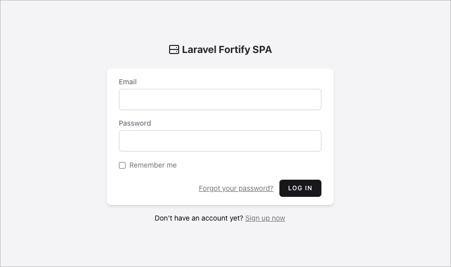
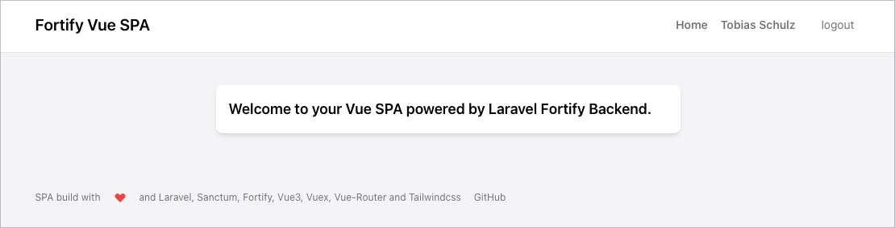
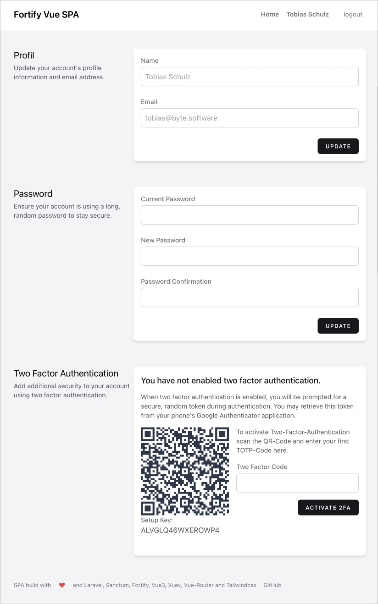
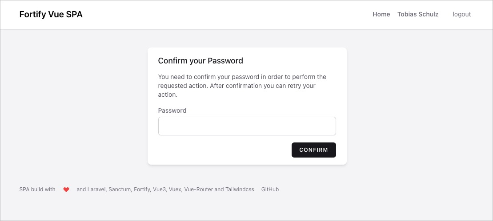

<p align="center"><a href="https://laravel.com" target="_blank"></a></p>

<p align="center">
    
</p>

## Laravel Fortify Vue SPA

A simple and clean boilerplate to start a new SPA project with authentication and more features from fortify. Its like the little sister of Jetstream, but as SPA. This boilerplate uses the following tools:

- [Laravel 9.x](https://github.com/laravel/laravel)
- [Laravel Sanctum](https://laravel.com/docs/9.x/sanctum)
- [Laravel Fortify](https://laravel.com/docs/9.x/fortify)
- [Vue 3](https://github.com/vuejs/vue)
- [Vue Router](https://router.vuejs.org/)
- [Vuex](https://vuex.vuejs.org/)
- [Tailwindcss 3.x](https://tailwindcss.com/)

## Features

The following Sanctum and Fortify features are implemented in this Vue SPA:

- ✅ Login
- ✅ Passwort Reset
- ✅ Registration
- ✅ Profile Management
- ✅ Password Confirmation
- ✅ Two Factor Authentication with Confirmation
- ✅ E-Mail Verification

## Screenshots

A Picture Is Worth More Than A Thousand Words.










## Testing

PHPunit is ready setup to test the API side of this boilerplate. Tested are all Sanctum and Fortify features cause there are heavily based on there original tests. Thats a good starting point to add tests for your next project. To run the tests you can call phpunit like this:

```bash
php artisan test
```

## Contributing

Thank you for considering contributing to the Laravel framework! The contribution guide can be found in the [Laravel documentation](https://laravel.com/docs/contributions).

## Code of Conduct

In order to ensure that the Laravel community is welcoming to all, please review and abide by the [Code of Conduct](https://laravel.com/docs/contributions#code-of-conduct).

## Security Vulnerabilities

If you discover a security vulnerability within Laravel, please send an e-mail via [tobias@byte.software](mailto:tobias@byte.software). All security vulnerabilities will be promptly addressed.

## License

The Laravel framework is open-sourced software licensed under the [MIT license](https://opensource.org/licenses/MIT).    
The Vue framework is open-sourced software licensed under the [MIT license](https://opensource.org/licenses/MIT).    
This repository is open-sourced software licensed under the [MIT license](https://opensource.org/licenses/MIT).    
